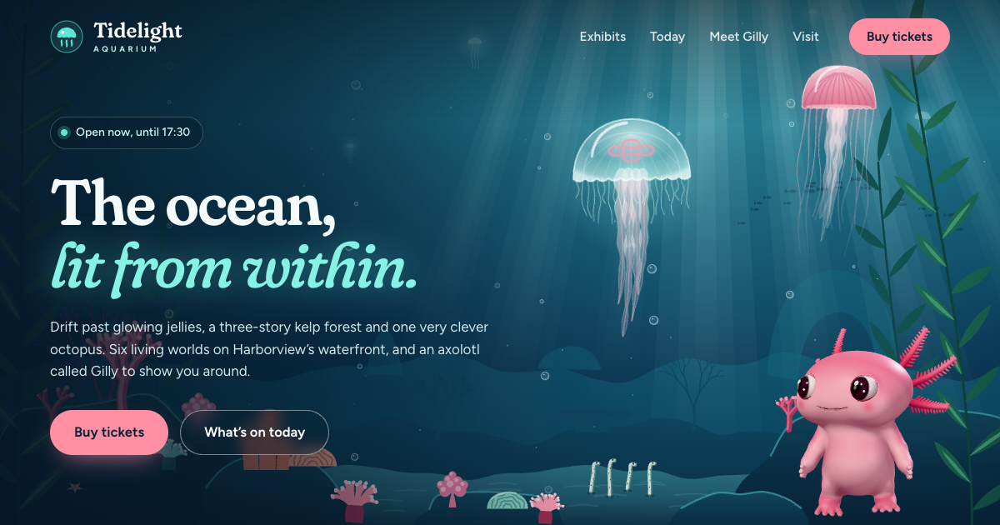
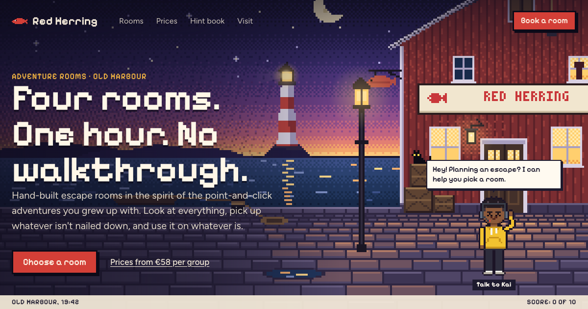
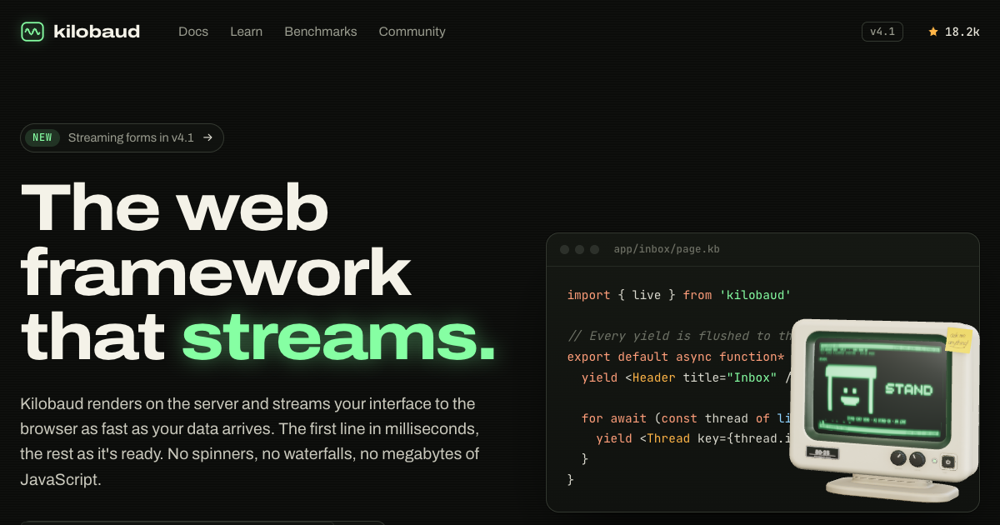
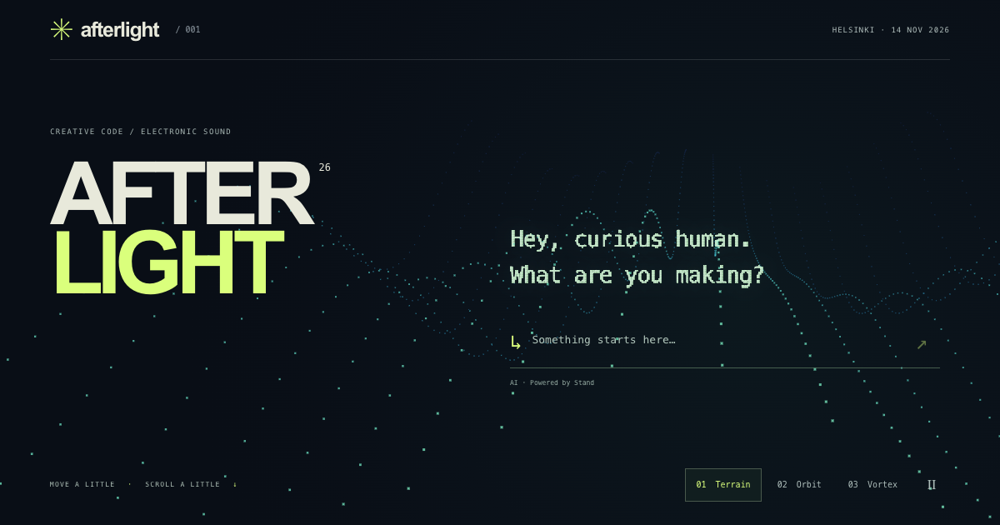

# Custom chat UI examples

Working chat front ends in plain HTML, CSS and JavaScript: animated characters, a CRT terminal, inline components, and a particle renderer.

**[Live demos](https://examples.stand.chat/)** · Run the same examples locally: **`npm start`**.

<p>
  <a href="https://examples.stand.chat/chat-mascot/"></a>
  <a href="https://examples.stand.chat/adventure-game-chat/"></a>
</p>
<p>
  <a href="https://examples.stand.chat/vintage-terminal/"></a>
  <a href="https://examples.stand.chat/demoscene-chat/"></a>
</p>

Each directory contains a runnable example and an implementation walkthrough. No framework or build step. These were built with AI coding agents; several include the original prompts and build notes.

The UI code is public domain. Conversations use [Stand Chat's hosted API](https://stand.chat/guide/custom-chat-ui), with a shared demo configuration included.

## Run locally

```sh
npm start
```

This builds the example list and serves the site at http://localhost:3000. It needs Node 18 or newer and installs nothing.

The examples load Stand with `data-stand-id="demo"`, Stand Chat's shared demo site. It answers on any domain, including localhost, through Stand Chat's demo Stand-in. The status pill in each example's top bar shows what Stand sees. Add `?preview` to a URL to show hidden Stand elements while you work on layout.

## Copy an example

```sh
npx degit standchat/examples/stand-card my-stand-card
```

Then replace its Stand `<script>` tag with the installation snippet from **Sites** in Stand, which carries your own Site ID.

## How the site works

- `index.html` is the front page. Its gallery lists `examples.json`, which `build.mjs` generates from each example's `<head>`. Short browsing descriptions in `index.html` highlight the reusable chat UX; new contributions use their own metadata automatically. The `ORDER` list in `build.mjs` puts the most interesting examples first; any others follow alphabetically. The introduction uses the examples' social images in a collage inspired by `_shared/og.png`.
- `_shared/` holds the example pages' top bar and "How it works" styles. The examples work without it.
- `_template/` is the starting point for a new example. See [CONTRIBUTING.md](CONTRIBUTING.md).
- Social images (`og.png`) are committed. The build only checks that they are 1200×630; it never regenerates them. To recapture with Chrome, run `npm run og` for all of them or `npm run og -- <folder>` for one (`og.mjs`).
- Vercel runs `node build.mjs` and serves the repository as it is (`vercel.json`).

## License

Public domain under the [Unlicense](LICENSE). Copy anything.

Stand Chat's name, logo and mascot aren't covered by it.
